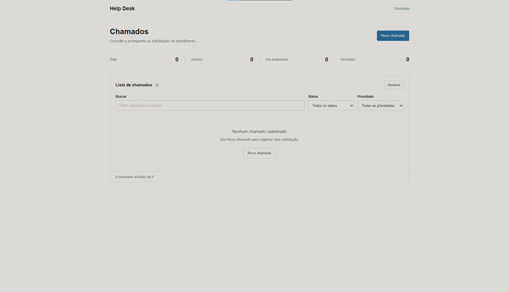
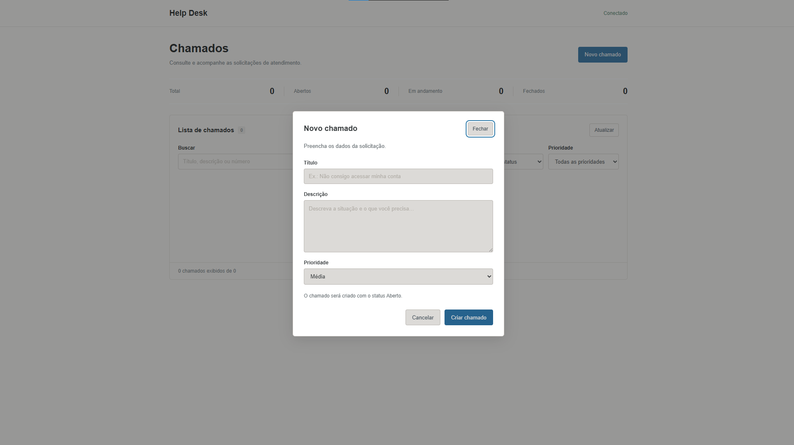
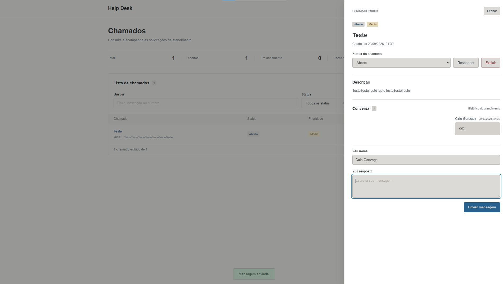

# Help Desk

Sistema de gerenciamento de chamados desenvolvido com Node.js, Express e SQLite.

Permite criar, consultar, filtrar, atualizar e excluir chamados, além de manter
um histórico de mensagens dentro de cada atendimento.

## Preview



### Detalhes do chamado



### Conversa



## Funcionalidades

- Criação de chamados
- Listagem de chamados
- Busca por ID
- Filtro por status
- Filtro por prioridade
- Alteração de status
- Exclusão de chamados
- Histórico de mensagens
- Resposta dentro do chamado
- Persistência com SQLite
- Validações da API
- Interface responsiva

## Tecnologias

- JavaScript
- Node.js
- Express
- SQLite
- HTML
- CSS

## API

### Chamados

GET /chamados

GET /chamados/:id

POST /chamados

PATCH /chamados/:id

DELETE /chamados/:id

### Mensagens

GET /chamados/:id/mensagens

POST /chamados/:id/mensagens

## Executar o projeto

Requer Node.js 24 ou superior.

```bash
git clone LINK_DO_SEU_REPOSITORIO
cd helpdesk-api
npm install
npm start
